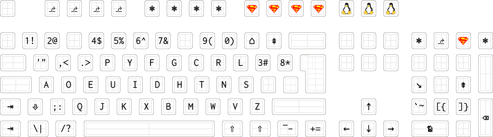

kinesis-dvorak
==============

SVG keycap generator for a DVORAK [Kinesis Advantage](http://www.kinesis-ergo.com/shop/advantage-for-pc-mac/), suitable for custom printing by [Signature Plastic / Keycaps Direct](http://keycapsdirect.com/) or [WASD](http://www.wasdkeyboards.com/). Keep an eye on [PimpMyKeyboard](http://www.pimpmykeyboard.com/) for Kinesis support.

The Kinesis Advantage is easily the best keyboard on the market (until [keyboard.io](http://www.keyboard.io/) is available or somebody commercialises [ErgoDox](http://ergodox.org/)), but the DVORAK variant is awful: coming with mixed QWERTY/DVORAK keycaps that are impossible to use.

This project is to produce a custom layout (which deviates from the standard DVORAK layout in several places for improved efficiency) in SVG files that are accepted by custom plastics companies. If you're a DVORAK user, this is the ultimate typing experience (but not cheap... spoil yourself!).

This is a summary of what my layout looks like, in [DCS conventions](http://keycapsdirect.com/key-caps.php) (R1 is top row). Note that the [WASD conventions](http://support.wasdkeyboards.com/customer/portal/articles/1366948-keycap-compatibility) are different (R1 is bottom row).

[Source](https://geekhack.org/index.php?PHPSESSID=ufjo1dfhkfh8jf5r6e8f80qqm1&topic=23446.msg878341#msg878341).

The following is a heuristic conversion table. `~` means there is not an exact equivalent.

| DCS     | WASD                                                                                                                     | Notes                                                                                                                                                                                                                                                           |
|---------|--------------------------------------------------------------------------------------------------------------------------|-----------------------------------------------------------------------------------------------------------------------------------------------------------------------------------------------------------------------------------------------------------------|
| R1      | [R4](http://www.wasdkeyboards.com/index.php/products/blank-keycap-singles/row-4-size-1x1-cherry-mx-keycap.html)          |                                                                                                                                                                                                                                                                 |
| R1 1.25 | ~[R1 1.25](http://www.wasdkeyboards.com/index.php/products/blank-keycap-singles/row-1-size-1x1-25-cherry-mx-keycap.html) | Rotate 180° (short side up for printing)                                                                                                                                                                                                                        |
| R2      | [R3](http://www.wasdkeyboards.com/index.php/products/blank-keycap-singles/row-3-size-1x1-cherry-mx-keycap.html)          |                                                                                                                                                                                                                                                                 |
| R3      | [R2](http://www.wasdkeyboards.com/index.php/products/blank-keycap-singles/row-2-size-1x1-cherry-mx-keycap.html)          | 2 [lined](http://www.wasdkeyboards.com/index.php/products/blank-keycap-singles/row-2-size-1x1-line-cherry-mx-keycap.html), 1 [dotted](http://www.wasdkeyboards.com/index.php/products/blank-keycap-singles/row-2-size-1x1-dot-cherry-mx-keycap.html) per layout |
| R3 1.25 | ~[R1 1.25](http://www.wasdkeyboards.com/index.php/products/blank-keycap-singles/row-1-size-1x1-25-cherry-mx-keycap.html) |                                                                                                                                                                                                                                                                 |
| R4      | [R1](http://www.wasdkeyboards.com/index.php/products/blank-keycap-singles/row-1-size-1x1-cherry-mx-keycap.html)          |                                                                                                                                                                                                                                                                 |
| R5      | --                                                                                                                       | DCS only, maybe WASD R4?                                                                                                                                                                                                                                        |
| R4/4  | [Num Zero](http://www.wasdkeyboards.com/index.php/products/blank-keycap-singles/row-1-size-1x2-00-cherry-mx-keycap.html) |                                                                                                                                                                                                                                                                 |
| R4 1x2    | [Num Enter](http://www.wasdkeyboards.com/index.php/products/blank-keycap-singles/numpad-enter-cherry-mx-keycap.html)     | Rotate Kinesis ⌦ 90° anticlockwise, Rotate Kinesis ↵ 90° clockwise (short side up for both for printing)                                                                                                                                                        |

To use the script to generate your own layout, open it up and read the comments. You'll need to be familiar with UNIX shell scripting to make sense of it.

And this is what it produces (but send the SVG file to your printer):

This first printing is missing the `-_`, `=+` and `⌦` caps, but luckily they can be temporarily replaced by the stock keycaps. The replacements work well for almost all the keys (including `⎈`), but the `⎇` / Super keys could do with an extra few mm to clear the keys beneath. If I was being *really* nitpicky, the blue keys on the centre row could benefit from being a little lower profile.

All in all, a roaring success, treat yourself!
